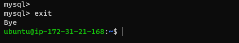

## Step1 

## INSTALLING THE NGINX WEB SERVER

`sudo apt update`

`sudo apt install nginx`

`sudo systemctl status nginx`

`curl http://127.0.0.1:80`

`curl -s http://169.254.169.254/latest/meta-data/public-ipv4`

`http://<Public-IP-Address>:80`

## Step2

## INSTALLING MYSQL

`sudo apt install mysql-server`

`sudo mysql -p`

`ALTER USER 'root'@'localhost' IDENTIFIED WITH mysql_native_password BY 'PassWord.1';`

`exit`

`sudo mysql_secure_installation`

`sudo mysql -p`

`exit`

