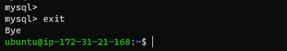
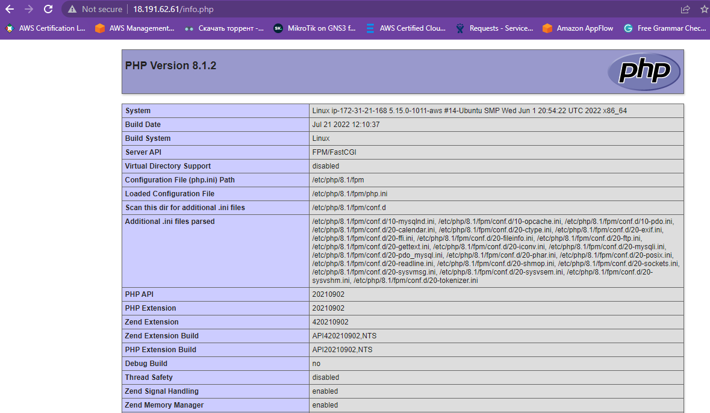
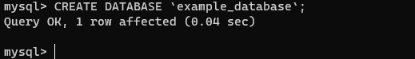

## Step1 

## INSTALLING THE NGINX WEB SERVER

`sudo apt update`

`sudo apt install nginx`

`sudo systemctl status nginx`

`curl http://127.0.0.1:80`

`curl -s http://169.254.169.254/latest/meta-data/public-ipv4`

`http://<Public-IP-Address>:80`

## Step2

## INSTALLING MYSQL

`sudo apt install mysql-server`

`sudo mysql -p`

`ALTER USER 'root'@'localhost' IDENTIFIED WITH mysql_native_password BY 'PassWord.1';`

`exit`

`sudo mysql_secure_installation`

`sudo mysql -p`

`exit`

## Step3

## INSTALLING PHP

`sudo apt install php-fpm php-mysql`

## Step4

##  CONFIGURING NGINX TO USE PHP PROCESSOR

`sudo mkdir /var/www/projectLEMP`

`sudo chown -R $USER:$USER /var/www/projectLEMP`

`sudo nano /etc/nginx/sites-available/projectLEMP`

`sudo ln -s /etc/nginx/sites-available/projectLEMP /etc/nginx/sites-enabled/`

`sudo unlink /etc/nginx/sites-enabled/default`

` sudo echo 'Hello LEMP from hostname' $(curl -s http://169.254.169.254/latest/meta-data/public-hostname) 'with public IP' $(curl -s http://169.254.169.254/latest/meta-data/public-ipv4) > /var/www/projectLEMP/index.html`

## Step5

##  TESTING PHP WITH NGINX

`sudo nano /var/www/projectLEMP/info.php`

`http://`server_domain_or_IP`/info.php`

## Step6

##  RETRIEVING DATA FROM MYSQL DATABASE WITH PHP

`sudo mysql`

`mysql> CREATE DATABASE `example_database`;`

`mysql>  CREATE USER 'example_user'@'%' IDENTIFIED WITH mysql_native_password BY 'password';`

`GRANT ALL ON example_database.* TO 'example_user'@'%';`

`exit`

`mysql -u example_user -p`

`mysql> SHOW DATABASES;`

`create todo list`

`INSERT INTO example_database.todo_list (content) VALUES ("My first important item");`

`SELECT * FROM example_database.todo_list;`

` exit`

`nano /var/www/projectLEMP/todo_list.php`

`http://<Public_domain_or_IP>/todo_list.php`

